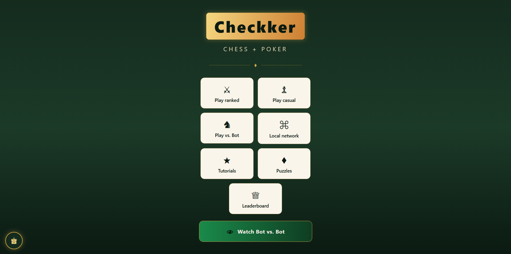
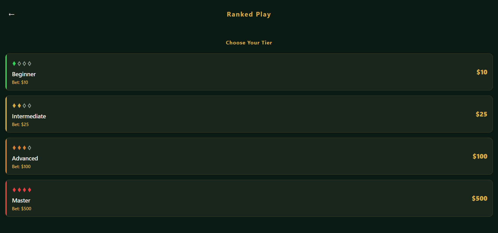
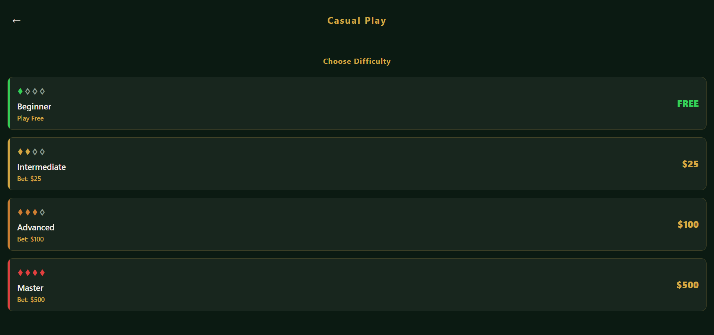
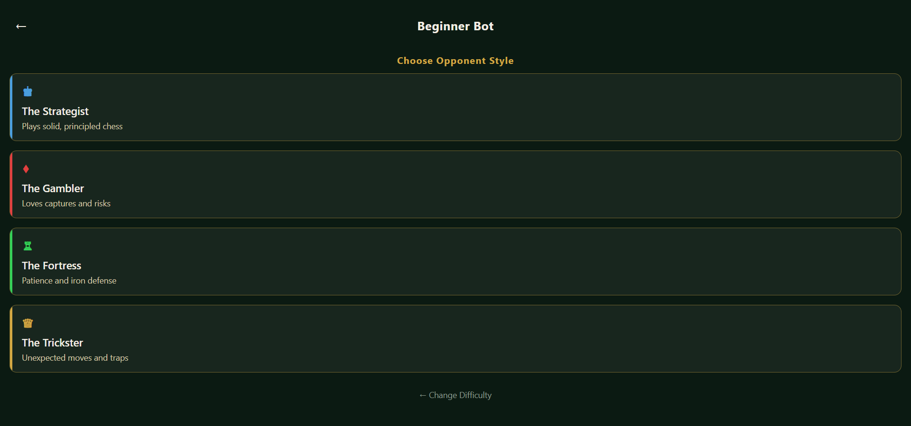
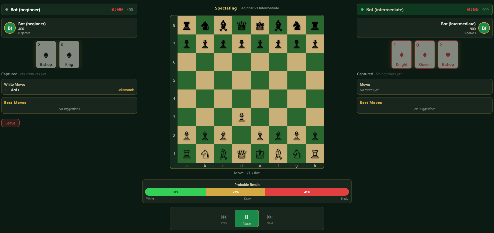
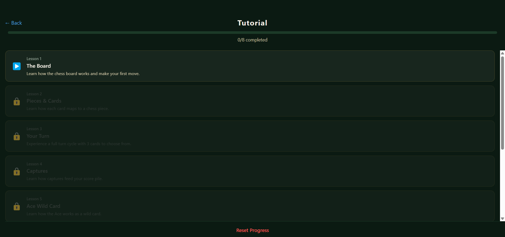
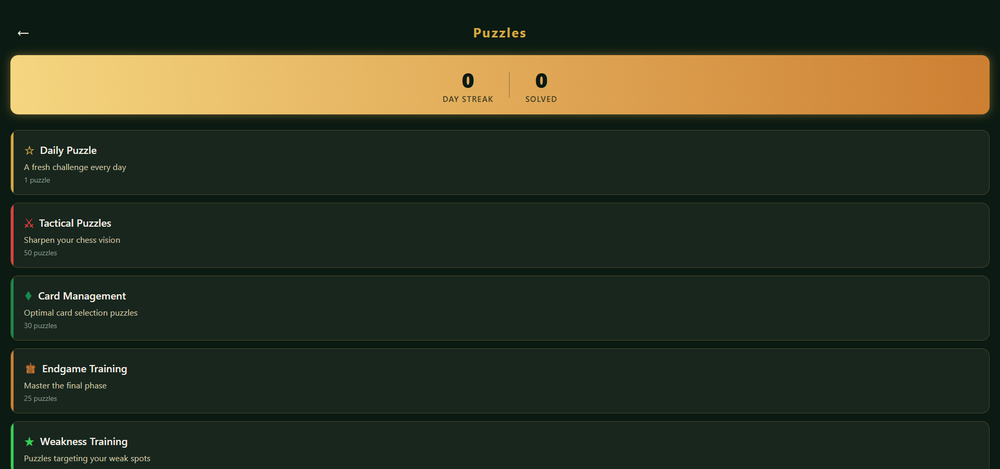
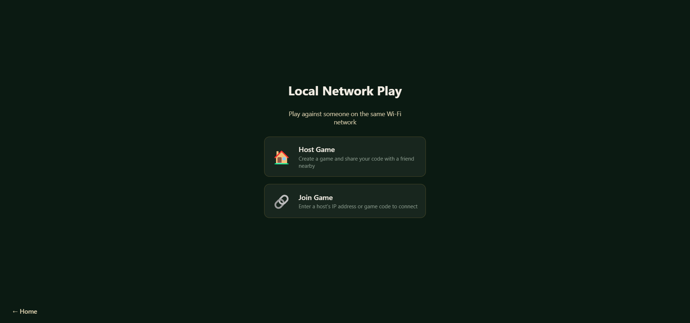

<p align="center">
  
</p>

<h1 align="center">Checkker</h1>
<h3 align="center">Chess + Poker. A new kind of strategy game.</h3>

<p align="center">
  <strong>Play chess where every move is dictated by playing cards.</strong><br/>
  Build poker hands from captured pieces. Bet crypto on ranked matches.<br/>
  Challenge adaptive AI bots or compete against real opponents worldwide.
</p>

<p align="center">
  <a href="#how-to-play">How to Play</a> &bull;
  <a href="#features">Features</a> &bull;
  <a href="#screenshots">Screenshots</a> &bull;
  <a href="#getting-started">Getting Started</a> &bull;
  <a href="#architecture">Architecture</a> &bull;
  <a href="#support-the-project">Donate</a>
</p>

---

## How to Play

Checkker fuses chess and poker into a single game. Here's the twist:

1. **Draw 3 cards** from a shared deck at the start of your turn
2. **Each card controls a piece type** &mdash; King, Queen, Knight, Rook, Bishop, Pawn, or Ace (wild)
3. **Play a card to move that piece** on the chess board using standard chess rules
4. **Captured pieces go to your score pile** where they're evaluated as poker hands
5. **Win by checkmate** (like chess) or **outscore your opponent** when the deck runs out

### Card &rarr; Piece Mapping

| Card | Piece | Cards in Deck |
|------|-------|:---:|
| K | King | 4 |
| Q | Queen | 4 |
| J | Knight | 4 |
| 10 | Rook | 4 |
| 2 | Bishop | 4 |
| 3&ndash;9 | Pawn | 28 |
| A | **Wild** (any piece) | 4 |

### Poker Scoring

Your captured pieces form poker hands scored at game end:

| Hand | Points |
|------|:------:|
| Royal Flush | 25 |
| Straight Flush | 18 |
| Four of a Kind | 14 |
| Full House | 10 |
| Flush | 8 |
| Straight | 6 |
| Three of a Kind | 4 |
| Two Pair | 3 |
| One Pair | 1 |

This creates a dual-layer strategy: pursue checkmate with pure chess tactics, or capture specific pieces to build powerful poker hands. Every card you play is a strategic choice between board control and score pile optimization.

---

## Features

### Game Modes

- **Ranked Play** &mdash; Competitive matchmaking with ELO ratings and crypto bets
- **Casual Play** &mdash; Relaxed matches with configurable difficulty (beginner is free)
- **Play vs Bot** &mdash; Four difficulty tiers with four personality styles each
- **Local Network** &mdash; Play against a friend on the same Wi-Fi
- **Spectate** &mdash; Watch bot vs bot with any difficulty pairing
- **Tutorials** &mdash; 8 structured lessons from basics to advanced strategy
- **Puzzles** &mdash; Tactical, card management, endgame, and weakness-targeted puzzles
- **Leaderboard** &mdash; Global rankings by ELO rating

### Adaptive AI System

The AI engine uses a **hybrid chess-poker evaluator** that weighs both board position and poker hand potential:

```
hybridScore = (chessCentipawns / 100) + (pokerScore x 2)
```

- **4 Difficulty Levels**: Beginner (400), Intermediate (900), Advanced (1400), Master (1900)
- **4 Personality Styles**: The Strategist, The Gambler, The Fortress, The Trickster
- **Adaptive Difficulty**: Bot analyzes your play style and adjusts
- **Player Modeling**: Tracks aggression, card conservation, and weakness patterns
- **Coaching Tips**: Optional AI-powered move explanations and post-game analysis
- **Pluggable Engines**: Heuristic engine with optional Stockfish integration

### Crypto Betting (BNB on BSC)

Stake real crypto on competitive matches via a trustless smart contract escrow:

| Tier | Bet Amount | House Cut |
|------|:----------:|:---------:|
| Beginner | $10 | 10% |
| Intermediate | $25 | 10% |
| Advanced | $100 | 10% |
| Master | $500 | 10% |

- **Wallet-only auth** &mdash; connect your wallet, no passwords
- **Smart contract escrow** &mdash; funds locked until game ends
- **Automatic payouts** &mdash; winner paid instantly on-chain
- **Draw refunds** &mdash; both players refunded in full (no house cut)
- **BSC Testnet** first, mainnet after audit

### ELO Rating System

| Tier | Rating | Badge |
|------|:------:|:-----:|
| Pawn | 0&ndash;999 | Novice |
| Knight | 1000&ndash;1399 | Intermediate |
| Bishop | 1400&ndash;1699 | Advanced |
| Rook | 1700&ndash;1999 | Expert |
| Queen | 2000&ndash;2299 | Master |
| King | 2300+ | Grandmaster |

### Procedural Sound Effects

All game audio is synthesized in real-time from oscillators &mdash; no sound files needed:

- Wooden move taps, heavy capture thuds, sharp check alerts
- Triumphant game-start fanfare, dramatic game-over cascade
- Castling clicks, promotion sparkles, checkmate power chords

### Cross-Platform

- **Web** &mdash; Any modern browser
- **Desktop** &mdash; Windows portable `.exe` (no installer needed)
- **Mobile** &mdash; iOS and Android via Expo

---

## Screenshots

<details>
<summary><strong>Ranked Mode &mdash; Bet tiers</strong></summary>

</details>

<details>
<summary><strong>Casual Mode &mdash; Free beginner, bets for higher tiers</strong></summary>

</details>

<details>
<summary><strong>AI Opponent Personalities</strong></summary>

</details>

<details>
<summary><strong>Bot vs Bot Spectate</strong></summary>

</details>

<details>
<summary><strong>Tutorials</strong></summary>

</details>

<details>
<summary><strong>Puzzles</strong></summary>

</details>

<details>
<summary><strong>Local Network Play</strong></summary>

</details>

---

## Getting Started

### Prerequisites

- **Node.js** 20+
- **npm** 11+

### Install

```bash
git clone https://github.com/civitechglobal/checkker.git
cd checkker
npm install
```

### Development

```bash
# Start server + web app (browser)
npm run dev

# Start desktop app (requires web export + server bundle first)
npm run export:web -w apps/mobile
npm run bundle -w apps/server
npm run dev:desktop
```

### Build Desktop `.exe`

```bash
npm run export:web -w apps/mobile
npm run bundle -w apps/server
npm run build -w apps/desktop
# Output: apps/desktop/dist/Checkker-*-portable.exe
```

### Smart Contract (optional)

```bash
cd packages/contracts
npx hardhat compile
npx hardhat test

# Deploy to BSC Testnet
REFEREE_ADDRESS=0x... HOUSE_WALLET=0x... npx hardhat run scripts/deploy.ts --network bscTestnet
```

### Database (optional, for persistent profiles)

```bash
cd packages/database

# Set DATABASE_URL in .env
npx prisma generate
npx prisma db push
```

### Environment Variables

| Variable | Description | Required |
|----------|-------------|:--------:|
| `DATABASE_URL` | PostgreSQL connection string | For profiles |
| `BSC_RPC_URL` | BSC RPC endpoint | For betting |
| `CHECKKER_CONTRACT_ADDRESS` | Deployed escrow contract | For betting |
| `REFEREE_PRIVATE_KEY` | Server hot wallet key | For betting |
| `HOUSE_WALLET_ADDRESS` | House wallet for fees | For betting |
| `BSC_CHAIN_ID` | `97` (testnet) or `56` (mainnet) | For betting |

Without blockchain env vars, the app runs in **free mode** &mdash; all game modes work without betting.

---

## Architecture

```
checkker/
├── apps/
│   ├── desktop/        Electron wrapper (portable .exe)
│   ├── mobile/         React Native + Expo (web, iOS, Android)
│   └── server/         Node.js game server (Socket.io)
├── packages/
│   ├── shared/         Game rules, types, constants
│   ├── chess/          Legal move generation per card
│   ├── poker/          Hand evaluation for score piles
│   ├── ai-brain/       Hybrid evaluator, adaptive bot, coaching, puzzles
│   ├── contracts/      Solidity escrow contract (Hardhat)
│   └── database/       Prisma ORM schema (PostgreSQL)
└── docs/
    └── screenshots/
```

### Tech Stack

| Layer | Technology |
|-------|-----------|
| Frontend | React Native, Expo, Expo Router, Reanimated |
| Desktop | Electron, electron-builder |
| Server | Node.js, Express, Socket.io |
| Game Logic | chess.js, custom poker evaluator |
| AI | Minimax + alpha-beta pruning, hybrid chess-poker scoring |
| Blockchain | Solidity (OpenZeppelin), ethers.js, Hardhat |
| Database | PostgreSQL, Prisma ORM |
| Build | Turborepo, esbuild, TypeScript |

### How It Works

1. **Player connects** &rarr; Wallet auth (signature verification) or anonymous for bot games
2. **Selects mode** &rarr; Ranked/Casual/Bot with difficulty tier
3. **Matchmaking** &rarr; Difficulty-based queues find opponents
4. **Escrow** &rarr; Smart contract locks both bets (non-free games)
5. **Play** &rarr; Real-time chess with card-driven moves
6. **Result** &rarr; Checkmate, resignation, timeout, draw, or deck exhausted
7. **Settlement** &rarr; Contract pays winner (90%) and house (10%)
8. **Ratings** &rarr; ELO updated, stats persisted, leaderboard refreshed

---

## Support the Project

Checkker is open source and built with passion. If you enjoy the game, consider supporting development with a donation.

### Donation Wallets

| Network | Address |
|---------|---------|
| **Bitcoin (BTC)** | `bc1q209xk5qutfyr9eqvwyje22wavw6yr6sdxuzcmj` |
| **Cardano (ADA)** | `addr1q8xv0453z20psvfrdtrwmjflwspfdmef6vfm8540ufsmctzp6adj7slsvhn0md8x9wppkz6l0249ms4lxhtk69ucncnqaxw70f` |
| **Dogecoin (DOGE)** | `D9VdaGDPD56645fRY2PYJoijniqrDUR5uS` |
| **XRP** | `rnGvcmWAJesxrhgeULDeqvZzMMsDidHYG9` |
| **BNB (BSC)** | `0x86EF35e6fe773fF461FCC367d48D6789F94E4b12` |
| **Solana (SOL)** | `AqoFb34GbWUYhxKqX3kmwLLuzp56FbPT3L9q8nzaArmX` |
| **Stellar (XLM)** | `GABGTWG4C3FXUTCS4KLEI26O24OVRCCLFXW7AVJIOVEGI2WVQ2OTK2ET` |
| **Sui (SUI)** | `0x1104f84617deeeb64a608e105649066b3c633d6636564e1c6dba817b0c541db5` |
| **Tron (TRX)** | `TFzgvBcp3jhFA4FZbcvsHYLNmeicHVY9wj` |

You can also donate directly from within the app by tapping the heart button on the home screen.

---

## License

All rights reserved. See [LICENSE](LICENSE) for details.
